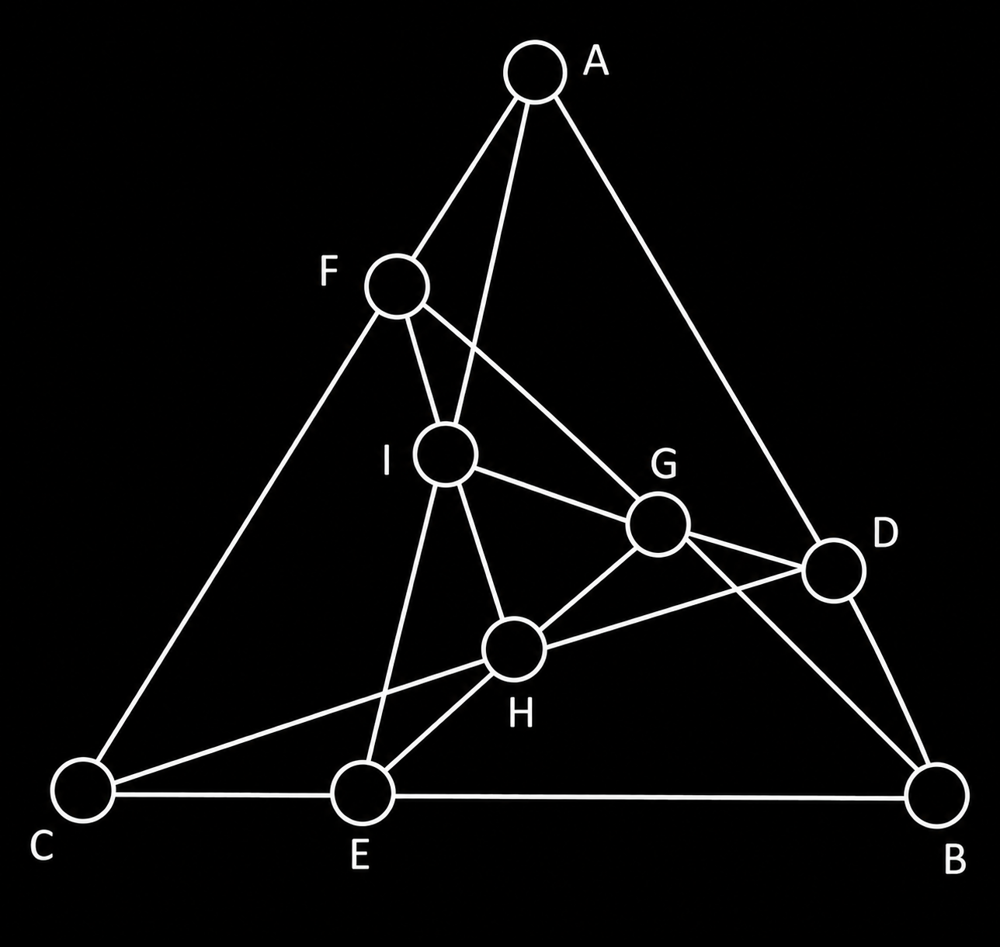

# Triangle Tic-Tac-Toe

A web version of triangle tic-tac-toe in development, alongside the preserved
Python terminal game.

The exact legacy board connections, phases, and winning combinations are
documented in [RULES.md](RULES.md).

## Features

- Human vs. AI mode
- AI vs. AI simulation
- Three AI levels: `Random`, `Advanced`, and `FastAdvanced`
- Precomputed moves in `BestMoves.json` for faster gameplay

## Requirements

- Python 3
- No external dependencies

## Run

### Static web board

The Phase 1 frontend requires Node.js and npm. Start the Next.js development
server from the repository root:

```bash
cd frontend
npm install
npm run dev
```

Then open the local address printed by Next.js. The current page is a static,
responsive board preview; interaction and game state belong to Phase 2.

### Legacy terminal game

```bash
python legacy/TriangleTicTacToe.py
```

Use the letters shown in the board image below as the position inputs:



By default, the game starts in Human vs. AI mode. During the first three rounds, enter only the letter (`a` to `i`) corresponding to the position where you want to place a new piece. From the fourth round onward, enter the letters corresponding to the current and new positions to move one of your pieces.

To change the game mode, edit the calls at the bottom of
`legacy/TriangleTicTacToe.py`:

```python
HumanVsAi('FastAdvanced')
# AIvsAI('FastAdvanced', 'FastAdvanced')
```

## Test

Install the development dependency and run the Phase 0 rule-characterization
tests with pytest:

```bash
python -m pip install -e ".[dev]"
python -m pytest
```

These tests protect the existing rule behavior while it is later separated
from terminal input/output for the web API.

## Files

- `legacy/TriangleTicTacToe.py` - preserved game rules, players, AI, and terminal modes
- `legacy/Statistics.py` - utility that generates precomputed best moves
- `legacy/Analysis.txt` - historical project analysis
- `BestMoves.json` - precomputed move database
- `board.png` - board reference showing the letter assigned to each position
- `RULES.md` - documented baseline for board connections and game rules
- `tests/` - focused pytest tests that characterize the legacy rules
- `pyproject.toml` - Python project metadata, dependencies, and test configuration
- `frontend/` - Next.js, TypeScript, React components, and responsive board styles
